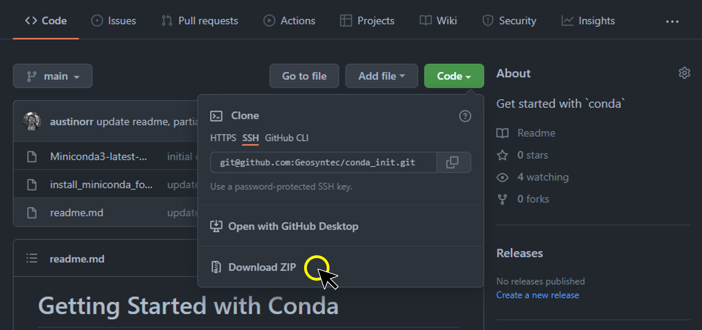

# Getting Started with Conda

This repository should help bootstrap new users of `conda` for managing programming environments.

If you do not have conda or anaconda on your machine, download this repo as a zip, prep & run the .bat, profit.
[Jump to Installation guide.](#installation)

**If you do already have miniconda or Anaconda on your machine, you need to plan to migrate away from those tools** and onto this one.
While you're here, look through the migration guide:

### Migration Guide

1. Check if you're conda is in compliance with our license policies.

   ```
   conda config --show channels
   ```

   ```output
   channels:
     - conda-forge
     - nodefaults
   ```

   If you see channels including `defaults` and `anaconda` then you are out of compliance and you are required to pay for a license.
   If you see any other channels and they're related to python packages (like `plotly` or `arcgis`) you should remove them.
   You can always specify the channel during installation if it's necessary, there's no need to add vendor or package-specific channels to your conda config.
   If you see the `r` channel (good for you using `r`!) consider removing it too.
   The `r` community moved to conda-forge in v3.6.2 (check yourself by running `conda search -c r -c conda-forge r-base`).

2. Disable the (unnecessary) channels that require an expensive license.

   Run these one at a time, if the channels don't exist, the command will error but you should keep marching through this list.

   ```
   conda activate base
   ```

   ```
   conda config --remove channels defaults
   ```

   ```
   conda config --remove channels anaconda
   ```

   ```
   conda config --add channels nodefaults
   ```

   ```
   conda config --add channels conda-forge
   ```

   After this command, _new_ python environments will be in compliance with the anaconda license, but old ones, including 'base' and 'anaconda' still might not.

3. Backup your current environments using this [conda-env-backup](https://github.com/Geosyntec/conda-env-backup) tool.
   It runs with no dependencies, so you can simply download the zip or copy the python file and run it in your 'base' conda environment.
   This will create a directory filled with folders, one for each environment.
   Each folder will have several txt files with all the packages and their versions.
   These files can help you rebuild your envs exactly as they are after you migrate to the miniforge variant of conda.

4. This is the big one: Remove all of your conda environments and start fresh with miniforge.
   You can do this by uninstalling Anaconda or miniconda via the "Apps>Installed Apps" panel in "Settings" or (if/when that doesn't work) via the old "Programs and Features" panel in "Control Panel".
   If these don't work, try again with admin privileges.
   If you're still unable to remove these programs, open a ticket and contact IT.

5. Proceed with the installation steps below.

## Installation

**_Only do this if you do not have `conda` installed on your machine._**

To see if you have conda, type the following into your command prompt:

```
conda --version
```

If you see a version number, you should [check that you're in compliance](#migration-guide) and then skip to the "How To `conda`" section.
If you see an error, then you probably need to install conda on your machine or add it to your path.

To be extra sure, search your start menu for 'anaconda', 'miniconda' and 'conda' to make sure the application is not installed on your machine.

Only 🫵 can prevent duplicate `conda` installs.

---

**_The following operations will install conda on your machine, so make sure this is what you want to do._**

1. Download this repository as a .zip file
   
2. Extract it
3. Open the extracted directory
4. Rename the file `install_latest_miniconda_for_user.txt` to `install_latest_miniconda_for_user.bat`.
   If this makes you squeamish - which is not unreasonable - here are the main brains of the file (you can/should check them yourself before running the .bat) which you can run manually in cmd prompt if you prefer:

   ```cmd
   @echo off
   echo Checking if miniforge3 already exists for this user...
   if exist %UserProfile%\miniforge3 (
      echo miniforge3 already exists for this user, exiting without modifying the system...
      pause
      EXIT /B
   ) else (
      echo installing conda via miniforge (aka license-free and open source!)...
      curl -L https://github.com/conda-forge/miniforge/releases/latest/download/Miniforge3-Windows-x86_64.exe -o miniforge3.exe
      start /wait "" .\miniforge3.exe /InstallationType=JustMe /RegisterPython=0 /AddToPath=1 /S /D=%UserProfile%\miniforge3
      echo installation complete.
      echo initializing conda for cmd prompt...
      %USERPROFILE%\miniforge3\condabin\conda init cmd.exe
      echo initialization complete.
   )
   pause
   ```

   The lines that do all the action are below, and you may run them yourself from the terminal if you wish (and then **skip** the next step which runs these commands in the .bat):

   From windows command prompt:

   ```cmd
   curl -L "https://github.com/conda-forge/miniforge/releases/latest/download/Miniforge3-Windows-x86_64.exe" -o miniforge3.exe
   ```

   ```cmd
   start /wait "" .\miniforge3.exe /InstallationType=JustMe /RegisterPython=0 /AddToPath=1 /S /D=%UserProfile%\miniforge3
   ```

5. Double click the "install_latest_miniconda_for_user.bat" file to install conda
   - If a blue pop up appears that indicates that Windows is protecting your PC by blocking a the .bat file from running, click 'More Info' and then 'Run Anyway'.
     This is "safe" because you read and understand everything the .bat file is doing.
   - This will install miniconda on your machine for your user profile.
   - The `conda` command will be available from the cmd prompt because it will be appended to your user PATH variable.
   - The location is "%UserProfile%\miniforge3".
     Normalizing this install location allows IT to find this directory and white-list certain processes if needed.
6. Open a new command prompt and try it out.
   One way to do so is to click your start menu and type `cmd`, then click Command Prompt.
   That should allow you to check if the install worked by running the following command:

   ```cmd
   conda --version
   ```

   ```output
   conda 25.5.1
   ```

   If it worked you'll see the `conda` version, or you'll be prompted to run `conda init` and try again.
   If it failed with

   ```output
   'conda' is not recognized as an internal or external command, operable program or batch file.
   ```

   Then you have not successfully installed conda on your system.
   If something else happened, you are on your own.

7. _**Optional**_ finish setting up `conda` with the following:
   ```cmd
   conda update -n base conda, mamba
   ```
   This will ensure you're running on the latest conda release.

## How to `conda`

**Always** create a `conda` environment for new projects that you work on.
This will allow you to properly 'silo' the libraries you install so that as you assist with more and more projects you're still able to return to old project environments and run the code with the libraries that worked for your project when it was written.
It also helps your peers recreate the project python environment on their machine during peer review or just in case you get hit by a train and are unable to work on your important project from the hospital.

To create a new environment for an example project called Regional Climate Assessment for which we'll need to load datafiles, do maths on them, make plots from the maths, and produce figures and summary statistics, we will create a new `conda` environment.

Let's call the new env 'rca' since we'll be typing it a lot.
We also know we want to work with `python` and use the `pandas` and `scipy` and `matplotlib` libraries to support our analysis.
Let's also install jupyter so we can do our exploratory analysis from `jupyter notebook`.

### Create an env

We can handle all this with a single command:

```cmd
conda create -n rca python=3.11 pandas scipy matplotlib jupyter
```

### Activate an env

Now all we need to do is to activate the env:

```cmd
conda activate rca
```

Now your command prompt looks something like this:

```cmd
(rca) >
```

That will make python and our libraries available to us from _this command prompt only_.

### Start doing project work with an env

Now we can navigate to our project directory and use this environment to do data analysis on our project files.
Changing to the project directory might like this, for example:

Switch to a network drive:

```cmd
(rca) >P:
```

Then change to the project directory (i.e., `cd`):

```cmd
(rca) >cd "P:/some/path/to/projects/Regional Climate Assessment/Technical Analysis"
```

Then we just launch a jupyter notebook and start working:

```cmd
(rca) >jupyter notebook
```

### Save and restore an env

It's important to be able to save a record of your packages so that others (or you) are able to recreate it.

There is a `conda` command to support saving your environment to a file:

```cmd
conda env export -n rca --no-builds > rca_env.yml
```

There is also a `conda` command to support creating a new environment from a environment yml file:

```cmd
conda env create -f rca_env.yml -n rca
```

### Install other libraries into an env

There will likely come a time when you need to do add libraries to your existing `conda` env.

Simply activate the environment that you wish to modify, and install the libraries:

```cmd
conda activate rca
(rca) >conda install geopandas -c conda-forge
```

The above command will install the `geopandas` library and all of its dependencies into the current environment.
The "-c conda-forge" ensures that all the libraries are fully compatible with eachother and with the libraries already installed within the current environment.
This is one of the main advantages to using `conda` is that for tricky packages like `geopandas` conda will help resolve package conflicts and ensure that the environment 'just works'.

Sometimes it's really helpful to run `conda env export` prior to installing or updating your libraries.
Keep that in mind in case your update breaks some of your old code and you need to try to track down the cause.

## How to `arcpy` (if you must)

ESRI products use python internally for many of their functions and both ArcGIS Pro and ArcMap 10.x expose their `arcpy` library for users with active licenses.

If you do not have a license, you will find that this section of this how-to document does not apply to you.

Everything in this section is also available (and likely more current) on ESRI's own documentation [here](https://pro.arcgis.com/en/pro-app/latest/arcpy/get-started/using-conda-with-arcgis-pro.htm).

### ArcGIS Pro

ESRI's fancy new multi-core modern desktop application, ArcGIS Pro, loves `conda` so much that they actually ship both `conda` and a massive `conda` environment containing python and other `arcpy` dependencies.

To use ArcGIS Pro's python when running standalone scripts that need `arcpy` use:

```cmd
>c:\Progra~1\ArcGIS\Pro\bin\Python\scripts\propy.bat my_script.py
```

To activate the ArcGIS Pro environment use:

```cmd
>c:\Progra~1\ArcGIS\Pro\bin\Python\scripts\proenv.bat
```

If you want to run an `arcpy` enabled jupyter notebook, simply `cd` to the directory containing the notebook file, run the above command to activate the `arcgispro-py3` environment, and then type `jupyter notebook`.

Consult ESRI's [documentation](https://pro.arcgis.com/en/pro-app/latest/arcpy/get-started/work-with-python-environments.htm) for other advanced features about the ArcGIS Pro environment, including cloning and installing new packages.
This is not necessary for nearly all use cases involving `arcpy`, but if you want to explore options, see their docs.

### ArcMap 10.x

Firstly, don't.
If you're still using ArcMap, consider starting to use ArcGIS Pro.

If that is not an option for you or your project, use the following command to execute the (long ago deprecated and abandoned) python 2.7 executable that ESRI ships with ArcMap 10.x:

```cmd
>c:\python27\ArcGIS10.7\python.exe my_script.py
```

You'll probably need to adjust the path above if you're using a different version of ArcMap.

If your clients require ArcMap, notify them immediately that it will be fully retired (no security updates) on March 1, 2026 and that the clock is ticking.
After that date we will likely not be able to run the software for them and comply with our other software security requirements.

Lastly, if you're still using ArcMap, consider starting to use ArcGIS Pro.
